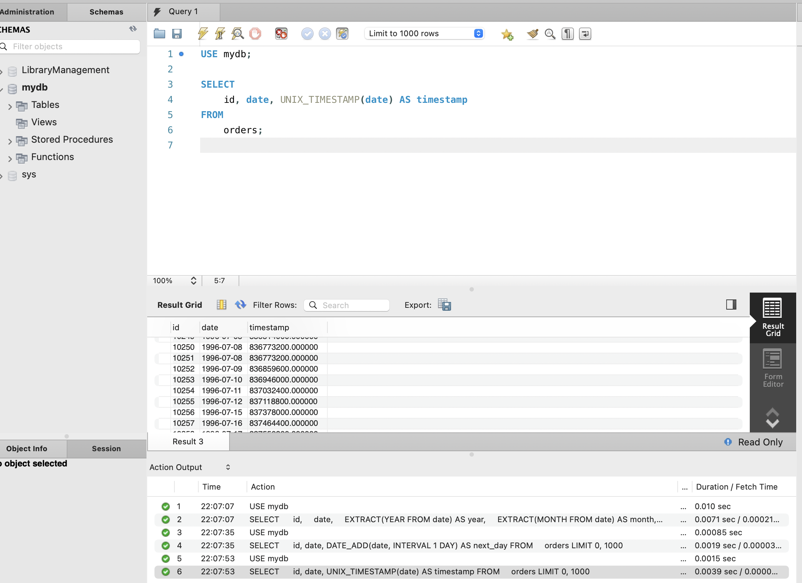

# Домашнє завдання до Теми 7. Додаткові вбудовані SQL функції. Робота з часом

### Результат виконаного ДЗ

1. Напишіть SQL-запит, який для таблиці `orders` з атрибута `date` витягує рік, місяць і число. Виведіть на екран їх у три окремі атрибути поряд з атрибутом `id` та оригінальним атрибутом `date` (всього вийде 5 атрибутів).
```js
USE mydb;

SELECT 
    id,
    date,
    EXTRACT(YEAR FROM date) AS year,
    EXTRACT(MONTH FROM date) AS month,
    EXTRACT(DAY FROM date) AS day
FROM
    orders;
```


2. Напишіть SQL-запит, який для таблиці `orders` до атрибута `date` додає один день. На екран виведіть атрибут `id`, оригінальний атрибут `date` та результат додавання.
```js
USE mydb;

SELECT 
    id, date, DATE_ADD(date, INTERVAL 1 DAY) AS next_day
FROM
    orders;
```


3. Напишіть SQL-запит, який для таблиці `orders` для атрибута `date` відображає кількість секунд з початку відліку (показує його значення timestamp). Для цього потрібно знайти та застосувати необхідну функцію. На екран виведіть атрибут `id`, оригінальний атрибут `date` та результат роботи функції.
```js
USE mydb;

SELECT 
    id, date, UNIX_TIMESTAMP(date) AS timestamp
FROM
    orders;
```


4. Напишіть SQL-запит, який рахує, скільки таблиця `orders` містить рядків з атрибутом `date` у межах між `1996-07-10 00:00:00` та `1996-10-08 00:00:00`.
```js
USE mydb;

SELECT 
    COUNT(*) AS count
FROM
    orders
WHERE
    date BETWEEN '1996-07-10 00:00:00' AND '1996-10-08 00:00:00';
```


5. Напишіть SQL-запит, який для таблиці `orders` виводить на екран атрибут `id`, атрибут `date` та JSON-об’єкт `{"id": <атрибут id рядка>, "date": <атрибут date рядка>}`. Для створення JSON-об’єкта використайте функцію.
```js
USE mydb;

SELECT 
    id,
    date,
    JSON_OBJECT('id', id, 'date', date) AS json_representation
FROM
    orders;
```
